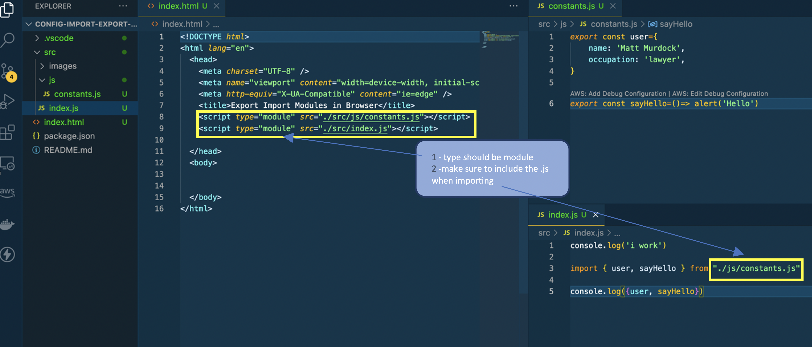
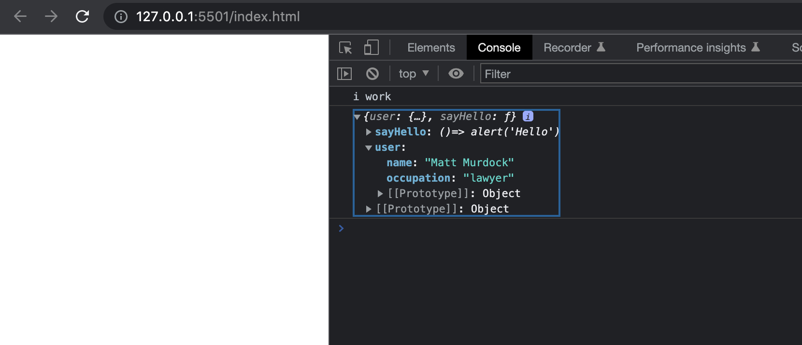

# Set Up

Only need 2 steps to get imports and exports working in the browser:

- 1.) Make sure to change the type in index.html to "module"
- 2.) Don't forget to include the .js file extension to whatever you're importing.

Verifed in the browser below

